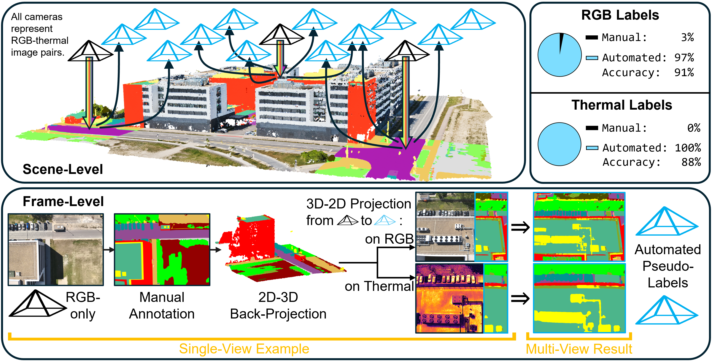

# SegFly: A 2D-3D-2D Paradigm for Aerial RGB-Thermal Semantic Segmentation at Scale

> 🔗 **[Project Website](https://markus-42.github.io/publications/2026/segfly/)** | 🔗 **[Project GitHub](https://github.com/markus-42/SegFly)**

## 📌 Overview
Developing robust semantic segmentation models for aerial perception requires large-scale, high-fidelity datasets. While combining RGB and thermal modalities enables highly reliable scene understanding across varying lighting and environmental conditions, both domains still rely heavily on labor-intensive manual annotation. 

SegFly is an automated data generation framework designed to solve this scalability bottleneck. By leveraging a novel point-based 2D-3D-2D rendering pipeline, this project autonomously generates dense, pixel-perfect semantic annotations for both RGB and aligned RGB-Thermal aerial imagery at scale, requiring minimal manual human-in-the-loop intervention.

## 🛠️ Summary of My Contributions

> 📄 **[Read the Detailed Technical Report Here](./SegFly.pdf)**

To enable scalable dataset creation, I implemented a comprehensive 3D-2D rendering pipeline. Building upon the 2D-3D label lifting methodology from OccuFly, this framework projects semantically enriched 3D point clouds back onto dense 2D target frames to generate autonomous annotations. 

My specific technical contributions include:
* **Depth-Aware 3D-2D Rendering Pipeline:** Designed a multi-stage projection framework to guarantee high-quality label generation:
  * *Semantic Projection with Z-Buffering* to retain only the closest points.
  * *Occlusion Filtering* to remove geometric inconsistencies and prevent background bleeding.
  * *Splatting-Based Densification* to expand spatial coverage while preserving depth consistency.
  * *Depth-Guided Label Propagation* using kNN to seamlessly resolve remaining unlabeled pixels.
* **Extreme Annotation Efficiency:** Synthesized an RGB dataset of 20,606 image-label pairs and an RGB-Thermal dataset of 15,007 samples using only 2.84% manual RGB supervision (and 0% manual thermal supervision).
* **Foundation Model Fine-Tuning:** Adapted and fine-tuned open-vocabulary vision foundation models (such as CAT-Seg) on the synthesized datasets. This validated the dataset's utility by achieving significant performance gains in domain adaptation and robust out-of-distribution generalization.

## 📊 Key Results & Qualitative Evaluation
The automatically generated pseudo-labels achieved exceptional quality across both modalities. 

### 1. RGB Dataset Generation
When evaluated against manual ground truth, the RGB pseudo-labels achieved **91% accuracy and 86% FWmIoU**.

*(Rows from top to bottom: RGB Image | Generated Pseudo-Label | Manual Ground Truth)*

### 2. RGB-Thermal Dataset Generation
The thermal pseudo-labels, generated entirely autonomously without any manual thermal annotations, achieved **88% accuracy and 79% FWmIoU**.

*(Rows from top to bottom: Thermal Image | Aligned RGB | Generated Pseudo-Label | Manual Ground Truth)*

## 🚀 Downstream Model Fine-Tuning
To validate the downstream utility of this data, state-of-the-art vision foundation models were fine-tuned on the synthesized RGB dataset. 
* **Domain Adaptation:** Fine-tuning led to significant performance gains over the zero-shot baseline, capturing precise object boundaries and correctly identifying complex classes.
* **Out-of-Distribution Generalization:** When benchmarked on the unseen CART dataset, the fine-tuned model demonstrated robust generalization, more than doubling the zero-shot accuracy (from 4.32% to 11.35%).
